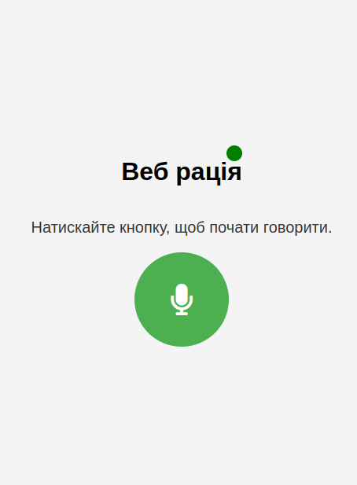

# Web Radio System (WRS)

## Description

"Web Radio" is a web application that allows users to make voice calls through their browser. The app uses WebRTC for audio recording and Socket.IO for real-time data transmission between clients, as well as for synchronizing user status. This project is useful for developers and users who want to create or use a web-based voice communication app without the need for additional software installation.

<p align="center">
  
</p>

## Features

- **Web application** for voice calls via the browser.
- **Real-time support** with Socket.IO for audio transmission and status synchronization.
- Uses **WebRTC** to access the microphone and record audio.
- Audio is recorded and stored on the server in WAV format.
- User status is indicated via color markers (green for ready, red for recording, yellow for playing audio).
- Supports simultaneous communication with multiple users.

## Technologies

- **Node.js** — server-side platform for handling requests.
- **Socket.IO** — library for real-time communication between the client and server.
- **Express** — web framework for Node.js.
- **WebRTC** — technology for exchanging multimedia data in real time.
- **MediaRecorder API** — for recording audio from the user's microphone.

## Project Structure

```
wrs
├─ README.md
├─ audio_recordings
├─ package-lock.json
├─ package.json
├─ public
│  ├─ client.js
│  ├─ index.html
│  └─ styles.css
└─ server.js
```

### File Descriptions:

- **server.js** — the backend of the application on Node.js that handles requests and communication via Socket.IO. It stores recorded audio files and transmits them to clients.
- **public/index.html** — the HTML page containing the user interface.
- **public/styles.css** — styles for the interface.
- **public/client.js** — JavaScript that manages the client-side interaction, audio processing, and communication with the server.
- **audio_recordings/** — directory for storing audio files.

## How to Run the Project

1. **Clone the repository:**

   ```bash
   git clone https://github.com/koliasa/Web-Radio-System.git
   cd wrs
   ```

2. **Install dependencies:**

   Use npm to install all required packages:

   ```bash
   npm install
   ```

3. **Start the server:**

   To run the server locally, use the command:

   ```bash
   npm start
   ```

   The server will run on port 3000 or the port set in the `PORT` environment variable.

4. **Open the app in your browser:**

   Open your browser and navigate to:

   ```
   http://localhost:3000
   ```
